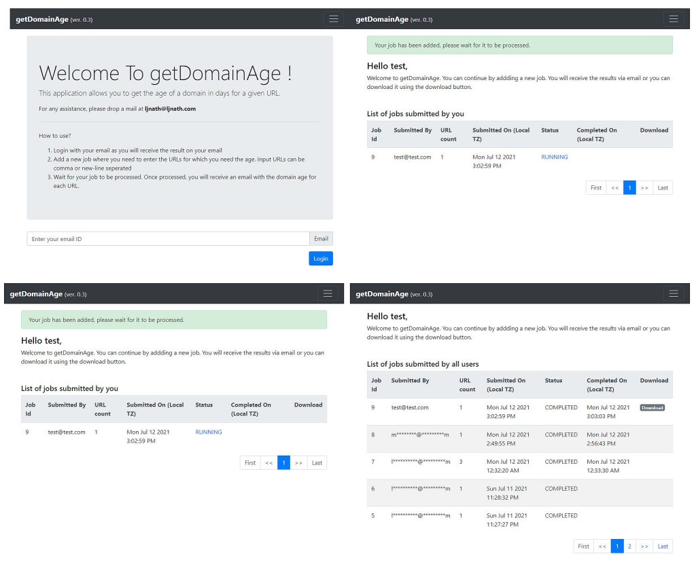

# getDomainAge
### Version : 0.3

Author: Lakhya Jyoti Nath (ljnath)<br>
Date: June 2019 - July 2021<br>
Email: ljnath@ljnath.com<br>
Website: https://ljnath.com

[](https://hub.docker.com/r/ljnath/getdomainage)

[](https://microbadger.com/images/ljnath/getdomainage)
[](https://github.com/ljnath/getDomainAge)


## What is it?

getDomainAge is a web application which can provide the age of a given domain name.
User can login using their email and they can add a job with one or more URLs. The application will pick these jobs sequentially and process these.
Job processing includes parsing the domain name from the URL, fetching its registration date, calculating its age (in days) and saving the result to a CSV file. It will also send an email to the user with the result file attached.

The intention of this project is to demonstrate flask for API development, SQLAlchemy for ORM and beautifulsoup for HTML parsing.
</br></br>

## How it works?

This application mainly consists of 2 components viz. application-server and worker-service.
1. Application server - This is built around flask which has a handful of APIs for user login, logout, addition of job, viewing of job and file download.

2. Worker service - This is an independent component which runs on a separate thread. It is responsible for picking up task from the database and completing those.
</br></br>

## What is the workflow?

- It works by scrapping the domain registration date from https://www.whois.com/
- User places their job request using the web portal where they can enter one or more URLs in comma or new-line separated manner. Jobs are stored in SQLite DB using SQLAlchemy
- A worker service looks for pending jobs in the database and picks it up.
- The worker service updates the job status to `RUNNING` and starts processing it using `DomainService`.
- `DomainService` checks for the domain registered date in local cache, if it is not there it parse that information from https://www.whois.com using `Beautiful Soup` and finally the result is saved as a CSV file.
- Next `EmailService` sends out an email to the job requestor with the result CSV attached.
</br></br>

## Application configuration
The configuration of the application is done using a JSON file. This file needs to be passed as argument while starting the application.
Following is the explained config file 
```json
{
    # complete path to the workspace directory
    # incase of docker, this should prefix with /workspace as shown below
    "workspace_path": "/workspace/my_workspace",

    # application server configuration
    "server": {
      "host": "0.0.0.0",
      "port": 80,
      "debug": false
    },

    # email configuration
    "smtp": {
      "host": "",
      "port": 25,
      "username": "",
      "password": "",
      "sender_email": ""
    },

    # application configuration
    "application": {
      "jobs_per_page": 10,
      "session_timeout": 10
    }
  }
```
</br>


## How to run in non-containerized environment?

- Clone the git repository
```
git clone https://github.com/ljnath/getDomainAge.git
```
- update the config.json file as per your need
- start the application using the following command
```
python runserver.py --config config.json
```
</br>

## How to run using docker ?

To run the getdomainage docker container, you need to mount a local directory to docker volume `/workspace`.
This directory should contain the application configuration file (`config.json`).
The SQLite database, cache, application logs and results will be created under the `/workspace` volume, so please make to have correct permissions.

```docker
docker run -p 5000:{server-port-as-per-config-json} -v /home/user/getDomainAge:/workspace -e CONFIG_FILE=config.json ljnath/getdomainage
```
</br></br>

## How to use ?

- Login with your email ID
- Add a new job where you need to enter your list of URLs in a form, which can be comma or new-line separated
- Wait for your job to be processed. Once processed, you will receive an email with the age of your selected domain.
</br></br>

## Sample


<br><br>


## Give a Star!⭐️

If you find this repository useful, please give it a star.
Thanks in advance !
</br></br>

## License

Copyright © 2021 [Lakhya's Innovation Inc.](https://github.com/ljnath/) under the [MIT License](https://github.com/ljnath/getDomainAge/blob/master/LICENSE).
